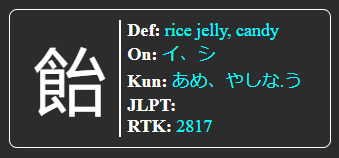

# Bulk Adder

This repo is created as a way to add information to all cards in an anki deck. It could also be used to postprocess the cards or download information from the cards. The current functionality adds information about all kanji used in a word. This information is added in the JSON format to a specified field and requires adding the following code to the card (probably the backside of the card):
`

`

and the following code to the styling of the card:
`
#kanji-container {
    display: flex;
    gap: 15px;
    padding: 15px;
    border: 2px solid rgba(255, 255, 255, 0.5); /* Semi-transparent border */
    border-radius: 10px;
    background-color: transparent; /* Transparent background */
}

.kanji-block {
    display: flex; /* Flexbox for side-by-side layout */
    align-items: center; /* Center items vertically */
    border: 1px solid white; /* White border */
    border-radius: 8px;
    padding: 10px;
    width: 300px; /* Increased width for wider cards */
    background-color: transparent; /* Transparent background */
}

.kanji-column {
    flex: 1; /* Allow kanji column to grow */
    display: flex; /* Center kanji */
    justify-content: center; /* Center kanji horizontally */
    align-items: center; /* Center kanji vertically */
}

.kanji-large {
    font-size: 72px; /* Increased font size for kanji */
    color: white; /* White text */
}

.separator {
    width: 2px; /* Width of the separator */
    background-color: white; /* Color of the separator */
    height: 100%; /* Full height */
}

.details-column {
    flex: 2; /* Allow details column to grow more */
    text-align: left; /* Align text to the left for better readability */
		font-size: 18px;
}

.kanji-details {
    color: white; /* White text */
    width: 100%; /* Make details take full width */
}

.detail {
		padding-left: 6px
}

.detail strong {
    width: 100px; /* Fixed width for labels to align colons */
}

.kanji-details span{
		color: cyan
}
`

An example output of the code is given below. This block would be added to your anki card.
